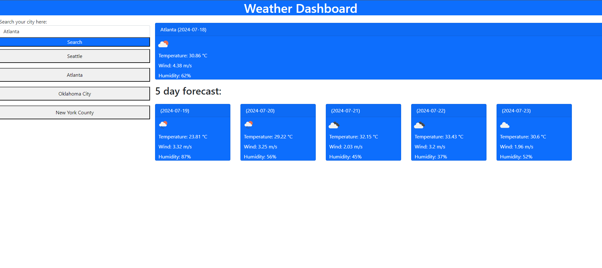

# weather-forecast
An app for viewing 5 day weather forecasts

## Description
This project was made to build familiarity with making API calls. It uses the openweathermap APIs to find coordinates of a searched city and weather info for that city.

[A link to the website](https://akaufmanfrey.github.io/weather-forecast/)

## Installation

N/A

## Usage

A tool for a user to search a city and see the 5 day weather forecast. Their search history is stored locally and displayed on the page as clickable buttons which search for the corresponding city when clicked.

## Credits

N/A

## License

Please refer to the LICENSE in the repo.